# bancoltau.com

## Executive Summary

This investigation analyzes a phishing website impersonating **Banco Itaú**, one of Brazil's largest financial institutions. The campaign uses a typosquatting domain to deceive users into providing sensitive personal information through a fraudulent banking portal. Technical analysis confirmed recently deployed infrastructure protected by Cloudflare, a valid TLS certificate, and behavior consistent with credential harvesting operations.

---

# Sample Information

| Field | Value |
|-------|--------|
| Sample ID | Sample001 |
| Threat Type | Brand Impersonation |
| Target Brand | Banco Itaú |
| Domain | bancoltau.com |
| Protocol | HTTPS |
| Status | Active during analysis |
| Severity | High |
| Confidence | High |

---

# Analysis Timeline

The investigation followed a structured workflow commonly used by Security Operations Center (SOC) analysts to validate the phishing infrastructure, collect technical evidence, extract Indicators of Compromise (IOCs), and assess the overall threat.

| Step | Activity | Status |
|------|----------|:------:|
| 1 | Identified the phishing URL through PhishTank | ✅ |
| 2 | Captured the phishing landing page and user interaction flow | ✅ |
| 3 | Analyzed domain reputation using VirusTotal | ✅ |
| 4 | Retrieved WHOIS registration information | ✅ |
| 5 | Performed DNS and certificate validation using MXToolbox | ✅ |
| 6 | Reviewed TLS certificate details | ✅ |
| 7 | Executed behavioral analysis using ANY.RUN | ✅ |
| 8 | Reviewed URLScan network activity | ✅ |
| 9 | Extracted Indicators of Compromise (IOCs) | ✅ |
| 10 | Mapped observed activity to the MITRE ATT&CK Framework | ✅ |
| 11 | Assessed the threat and documented findings | ✅ |

---

# Executive Overview

The investigated domain **bancoltau.com** was created to impersonate Banco Itaú by exploiting a typosquatting technique in which the uppercase letter **"I"** is replaced with the lowercase letter **"l"**, making the domain visually similar to the legitimate banking website. The phishing page requests the victim's CPF as the initial authentication factor before advancing through additional stages designed to collect sensitive information. Infrastructure analysis identified a recently registered domain protected by Cloudflare, a valid TLS certificate issued by Google Trust Services, and network activity consistent with a credential harvesting phishing kit.

---

# Landing Page Analysis

The phishing website closely imitates Banco Itaú's authentication portal and prompts users to provide their CPF before continuing the authentication process. The visual design and interaction flow closely resemble the legitimate banking website, increasing the likelihood of successful social engineering.

### Landing Page

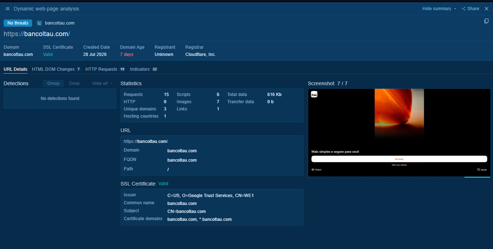

---

# VirusTotal Analysis

VirusTotal identified the domain as malicious and provided infrastructure information including IP addresses, ASN, certificate details, and related infrastructure.

### Domain Overview

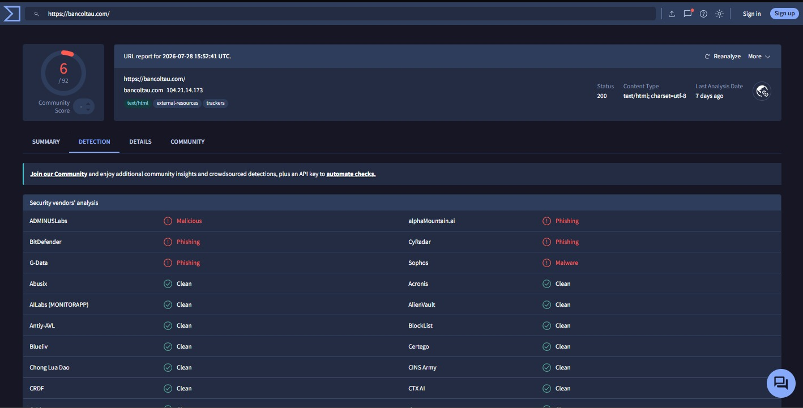

### Infrastructure Details

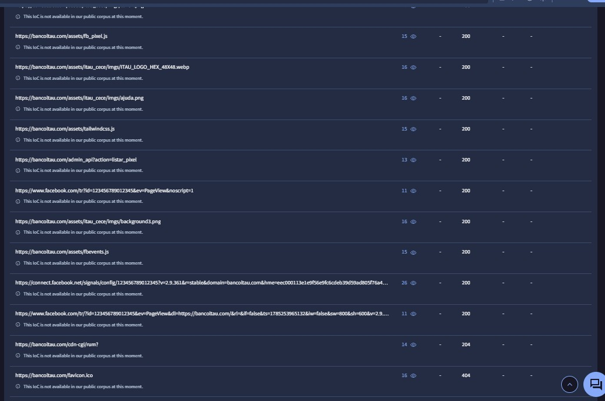

### Related Infrastructure

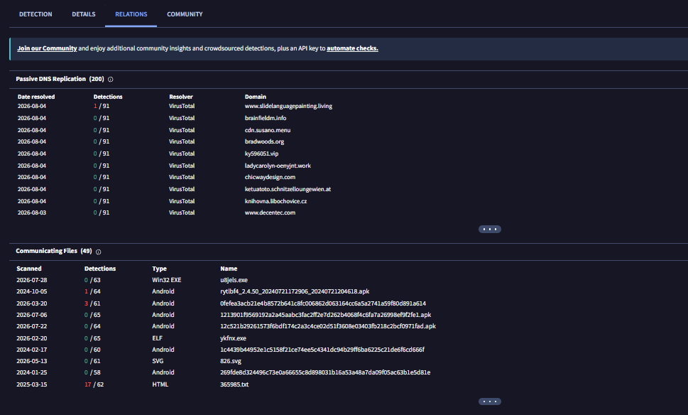

---

# WHOIS Analysis

WHOIS records indicate that the domain was recently registered, a characteristic frequently observed in phishing campaigns.

| Property | Value |
|-----------|--------|
| Registrar | Cloudflare, Inc. |
| Creation Date | 2026-07-28 |
| Expiration Date | 2027-07-28 |
| Status | clientTransferProhibited |

### Name Servers

- bowen.ns.cloudflare.com
- leah.ns.cloudflare.com

### WHOIS Evidence

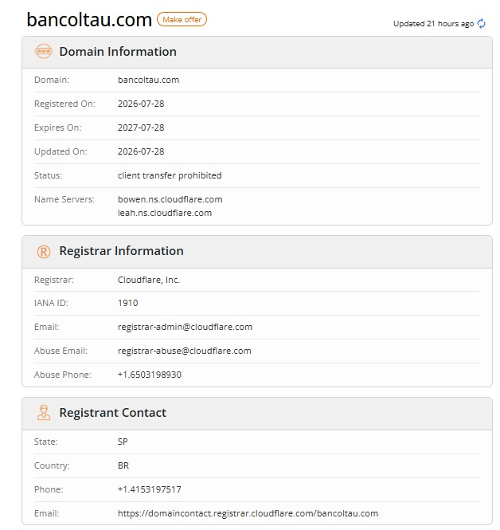

### Analyst Observation

The recent registration date strongly suggests infrastructure created specifically for malicious activity.

---

# DNS Analysis

DNS analysis confirmed that the phishing website is protected behind Cloudflare infrastructure.

### MXToolbox DNS Lookup

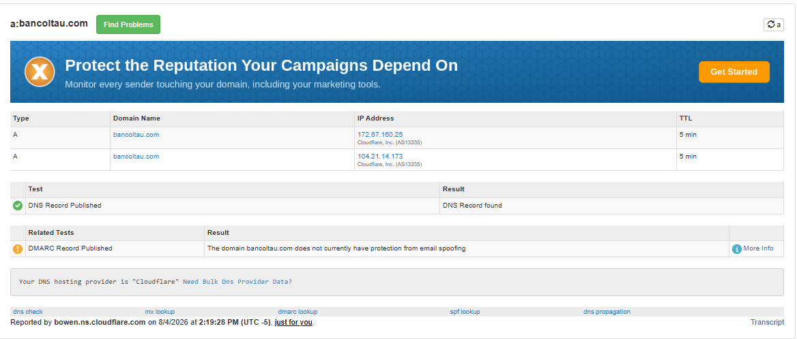

### Mail Infrastructure

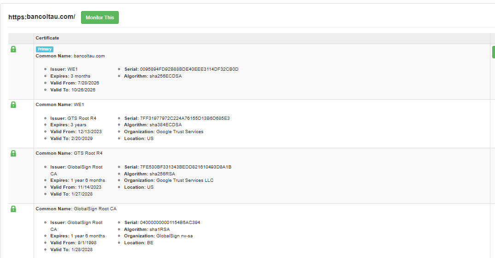

---

# TLS Certificate Analysis

The phishing website presents a valid HTTPS certificate issued by Google Trust Services.

| Property | Value |
|-----------|--------|
| Issuer | Google Trust Services (WE1) |
| Valid From | 2026-07-28 |
| Valid Until | 2026-10-26 |
| HTTPS | Enabled |

### Certificate

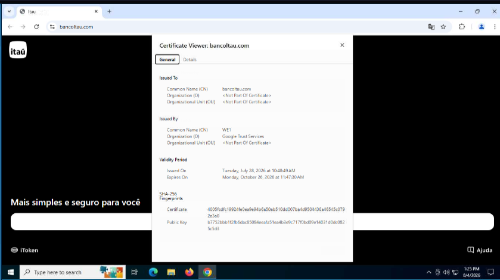

### Analyst Observation

The presence of a valid TLS certificate should not be interpreted as proof of legitimacy. Threat actors frequently obtain trusted certificates to increase user confidence and avoid browser security warnings.

---

# URLScan Analysis

URLScan identified the phishing infrastructure, associated network communications, and contacted external services during page execution.

### URLScan Summary

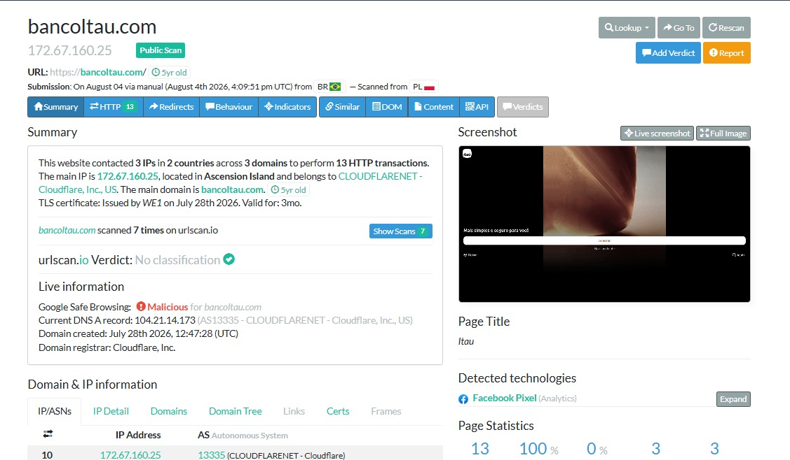

### Network Activity

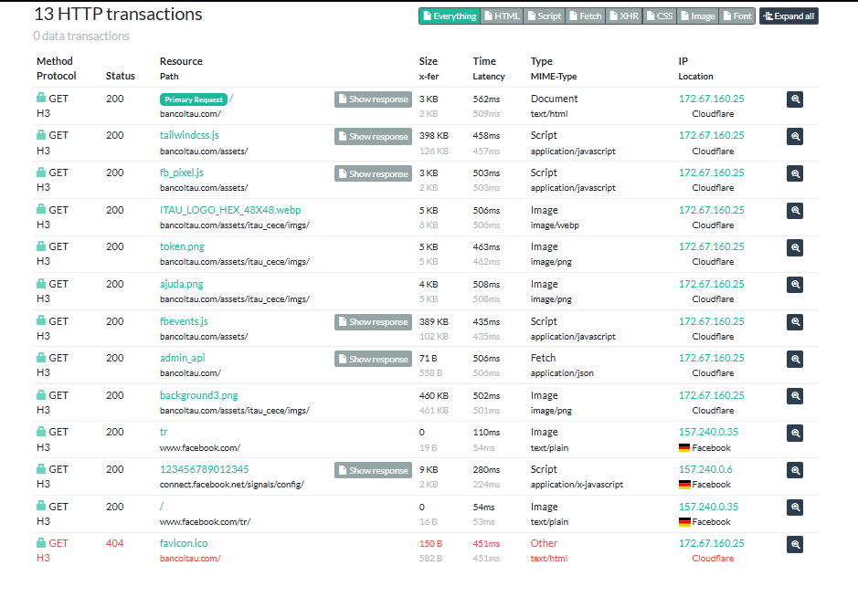

---

# ANY.RUN Analysis

Behavioral analysis confirmed active phishing behavior, including DNS resolution, HTTP requests, and user interaction with the fraudulent banking portal.

### Sandbox Overview

### Process Tree

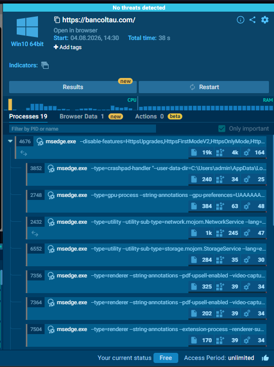

### Network Connections

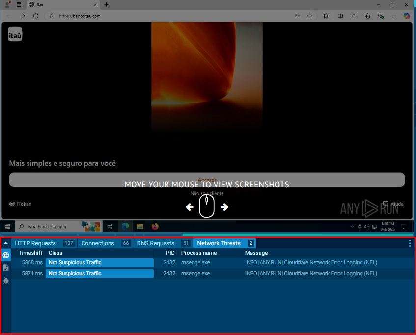

### HTTP Requests

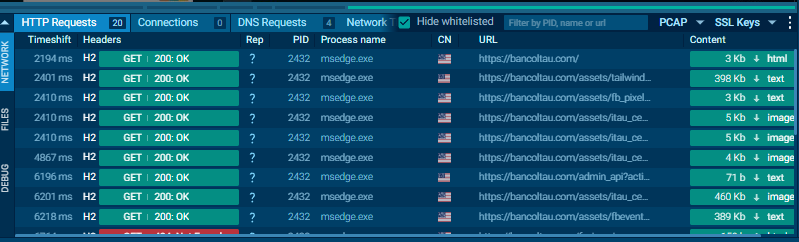

---

# Indicators of Compromise (IOCs)

| Type | Value |
|------|-------|
| Domain | bancoltau.com |
| URL | https://bancoltau.com |
| IP Address | 104.21.14.173 |
| ASN | AS13335 |
| Registrar | Cloudflare, Inc. |
| Name Server | bowen.ns.cloudflare.com |
| Name Server | leah.ns.cloudflare.com |
| TLS Issuer | Google Trust Services (WE1) |
| Reverse Proxy | Cloudflare |

---

# MITRE ATT&CK Mapping

| Tactic | Technique | Description |
|---------|-----------|-------------|
| Resource Development | T1583.001 | Acquire Infrastructure: Domains |
| Resource Development | T1583.006 | Acquire Infrastructure: Web Services |
| Initial Access | T1566 | Phishing |
| Credential Access | T1056.001 | Web Portal Credential Collection |

---

# Threat Assessment

| Category | Assessment |
|-----------|------------|
| Severity | High |
| Confidence | High |
| Campaign Type | Brand Impersonation |
| Objective | Credential Harvesting |
| Infrastructure Age | Recently Registered |

### Analyst Assessment

The investigated domain employs typosquatting to impersonate Banco Itaú and collect personally identifiable information from victims. The infrastructure was recently registered, protected behind Cloudflare, and configured with a valid TLS certificate to increase credibility. Behavioral analysis confirmed communication patterns consistent with an active phishing kit. Based on the collected evidence, this campaign is classified as a high-confidence phishing operation targeting Banco Itaú customers.

---

# Recommendations

## For End Users

- Verify domain names before entering personal or banking information.
- Access online banking services only through official channels.
- Enable Multi-Factor Authentication (MFA).
- Report suspicious websites to the appropriate security team.

## For Security Teams

- Block the identified domain and associated IP addresses.
- Monitor DNS queries for the collected indicators.
- Deploy SIEM detection rules for typosquatting domains targeting Banco Itaú.
- Share collected IOCs with Threat Intelligence platforms.

---

# References

- PhishTank
- VirusTotal
- URLScan.io
- WHOIS
- MXToolbox
- ANY.RUN
- Google Safe Browsing
