# Brand Impersonation (O Boticário)

## Executive Summary

This investigation analyzes a phishing website identified through PhishTank that impersonates **O Boticário**, a well-known Brazilian cosmetics retailer. The threat actor registered the domain **oboticariopresente.com** on the same day it was observed, indicating recently deployed malicious infrastructure.

The phishing page uses HTTPS with a valid TLS certificate issued by Google Trust Services (WE1), is protected by Cloudflare, and appears to be built using a Node.js Express application. The objective of the campaign is to deceive users into interacting with a fraudulent promotional website that mimics O Boticário.

---

# Sample Information

| Field | Value |
|-------|--------|
| Sample ID | Sample002 |
| Threat Type | Brand Impersonation |
| Target Brand | O Boticário |
| Domain | oboticariopresente.com |
| Protocol | HTTPS |
| Status | Active during analysis |
| Severity | High |
| Confidence | High |

---

# Executive Overview

The phishing infrastructure was created immediately before being observed, which is a common characteristic of credential harvesting campaigns. The attacker employed Cloudflare as a reverse proxy, preventing disclosure of the origin server while also deploying a valid TLS certificate to increase victim confidence.

---

# Landing Page Analysis

The phishing website closely imitates promotional pages associated with O Boticário. During the analysis, multiple interaction steps were identified before the payment stage.

### Initial Page

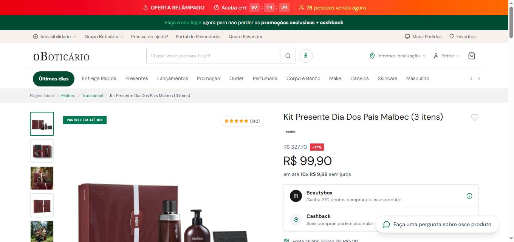

### Payment Method - Step 1

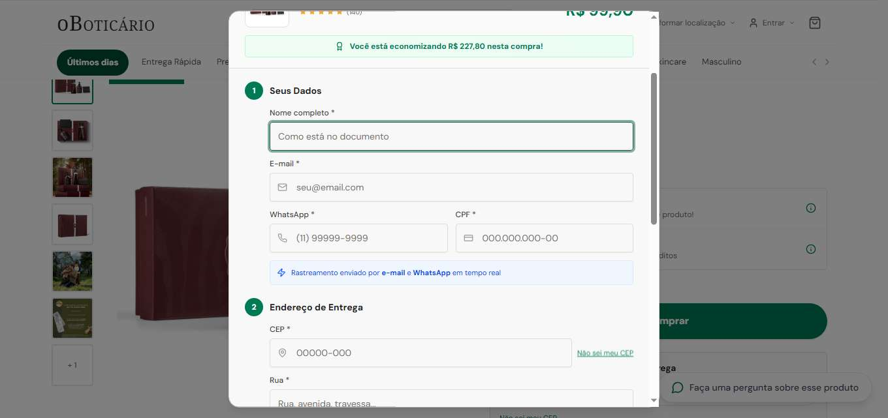

### Payment Method - Step 2

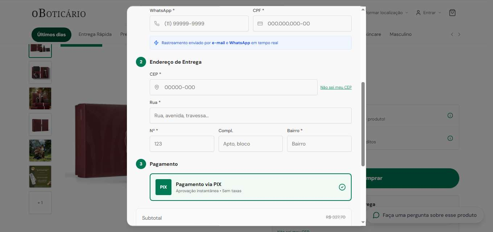

---

# VirusTotal Analysis

VirusTotal identifies the domain as suspicious and provides infrastructure information including DNS records, TLS certificate information and associated IP addresses.

### Domain Overview

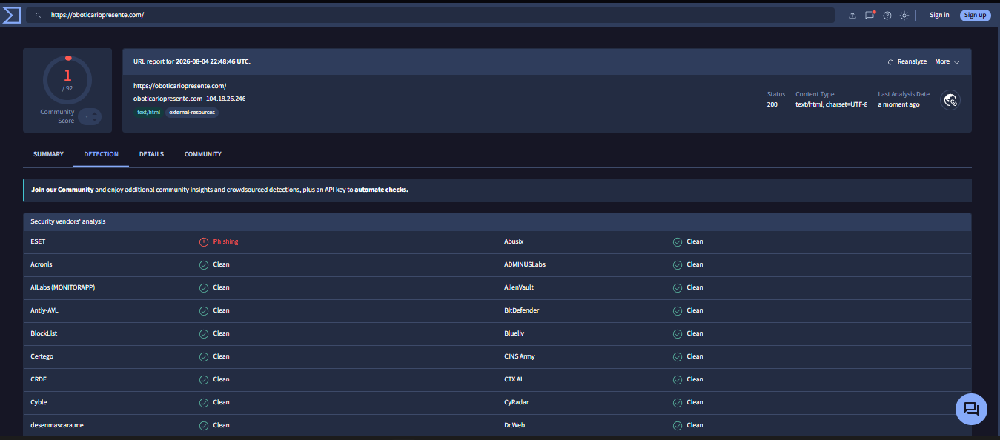

### Detection Summary

### Associated Infrastructure

The infrastructure is associated with Cloudflare IP addresses and recently issued certificates.

### Communicating Files

VirusTotal lists historical communicating files related to the observed infrastructure. These artifacts were reviewed but are not considered direct Indicators of Compromise for this phishing campaign.

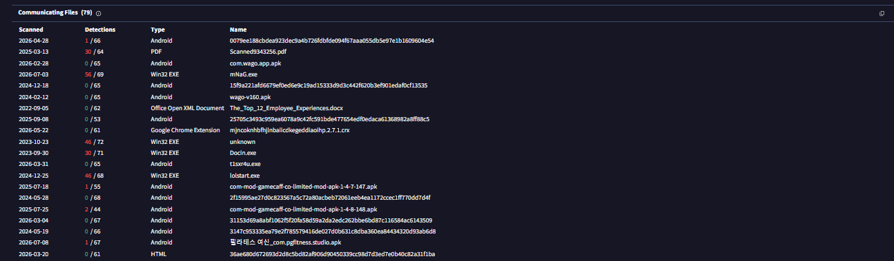

---

# WHOIS Analysis

WHOIS records reveal that the domain was registered on the same day the phishing campaign was identified.

| Property | Value |
|-----------|--------|
| Registrar | Global Domain Group LLC |
| Creation Date | 2026-08-04 |
| Expiration Date | 2027-08-04 |
| Status | clientTransferProhibited |
| Registrant | Privacy Protected |

### WHOIS Evidence

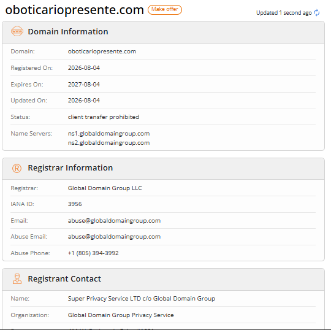

### Analyst Observation

The extremely recent registration strongly suggests malicious infrastructure created specifically for this campaign.

---

# DNS Analysis

DNS analysis shows the website is protected by Cloudflare.

### DNS Records

- 104.18.26.246
- 172.67.195.48

ASN:

- AS13335 (Cloudflare)

### DNS Requests (ANY.RUN)

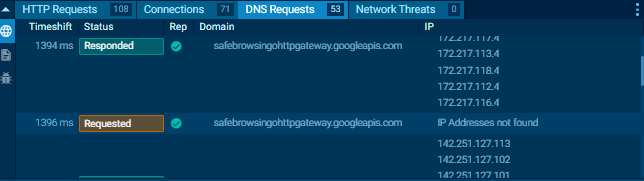

### MXToolbox DNS Lookup

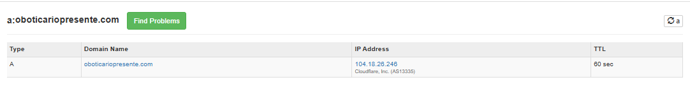

---

# TLS Certificate Analysis

The website presents a valid HTTPS certificate issued by Google Trust Services (WE1).

| Property | Value |
|-----------|--------|
| Common Name | oboticariopresente.com |
| Issuer | WE1 |
| Valid From | 2026-08-04 |
| Valid Until | 2026-11-02 |
| Algorithm | ECDSA SHA256 |

### Certificate (VirusTotal)

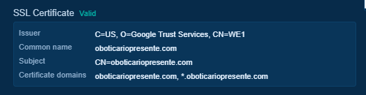

### Certificate Chain (MXToolbox)

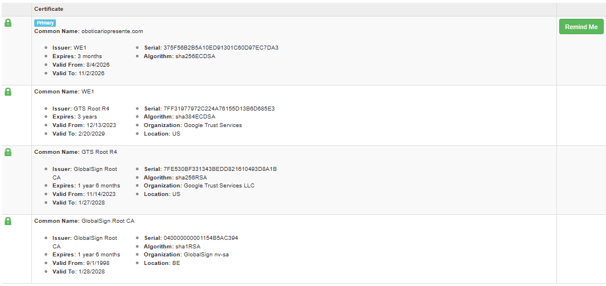

### Analyst Observation

Although the certificate is valid, HTTPS should not be interpreted as evidence of legitimacy. Threat actors frequently obtain free certificates to increase user trust.

---

# HTTP Analysis

Network traffic analysis indicates the application is hosted behind Cloudflare.

### HTTP Requests

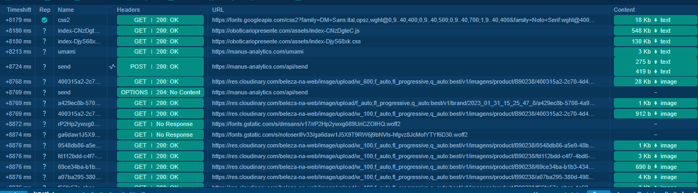

### Additional HTTP Requests

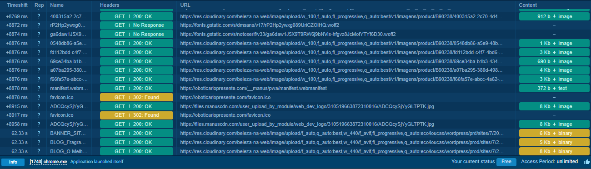

### HTTP Response Summary

| Property | Value |
|-----------|--------|
| Status Code | 200 OK |
| Server | Cloudflare |
| Framework | Express |
| Content Type | text/html |
| Body Size | 361 KB |

---

# ANY.RUN Analysis

Behavioral analysis confirms communication with multiple hosts during page interaction.

Observed activities include:

- DNS resolution
- HTTPS communication
- Multiple HTTP requests
- Dynamic page rendering
- User interaction with payment workflow

No malware execution was observed during the analysis.

---

# Blacklist Verification

MXToolbox blacklist verification was performed during the investigation.

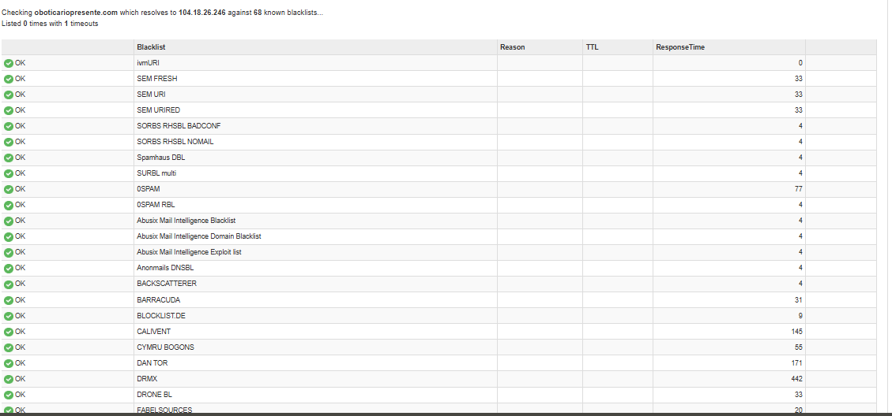

---

# Indicators of Compromise (IOCs)

| Type | Value |
|------|-------|
| Domain | oboticariopresente.com |
| URL | https://oboticariopresente.com |
| IP Address | 104.18.26.246 |
| IP Address | 172.67.195.48 |
| ASN | AS13335 |
| Registrar | Global Domain Group LLC |
| Name Server | ns1.globaldomaingroup.com |
| Name Server | ns2.globaldomaingroup.com |
| TLS Issuer | WE1 |
| Framework | Express |
| Reverse Proxy | Cloudflare |

---

# MITRE ATT&CK Mapping

| Tactic | Technique | Description |
|---------|-----------|-------------|
| Resource Development | T1583.001 | Acquire Infrastructure: Domains |
| Resource Development | T1583.006 | Acquire Infrastructure: Web Services |
| Initial Access | T1566 | Phishing |
| Credential Access | T1056.001 | Web Portal Credential Collection |

---

# Threat Assessment

| Category | Assessment |
|-----------|------------|
| Severity | High |
| Confidence | High |
| Campaign Type | Brand Impersonation |
| Objective | Credential Harvesting / Financial Fraud |
| Infrastructure Age | Less than 24 Hours |

### Analyst Assessment

Several indicators strongly suggest malicious intent:

- Domain registered immediately before deployment.
- Brand impersonation targeting O Boticário customers.
- Valid TLS certificate issued on the registration date.
- Cloudflare reverse proxy masking the origin server.
- Multi-step phishing workflow designed to increase user engagement.

Overall, this infrastructure demonstrates characteristics commonly observed in modern phishing campaigns targeting Brazilian consumers.

---

# Recommendations

## For End Users

- Verify domain names before entering personal information.
- Avoid accessing promotional links received through unsolicited messages.
- Enable Multi-Factor Authentication (MFA).
- Report suspicious websites to security teams.

## For Security Teams

- Block the identified domain and IP addresses.
- Monitor DNS requests for the observed indicators.
- Create SIEM detection rules for the identified infrastructure.
- Share IOCs with internal Threat Intelligence platforms.

---

# References

- PhishTank
- VirusTotal
- URLScan.io
- WHOIS
- MXToolbox
- ANY.RUN
- Google Safe Browsing
